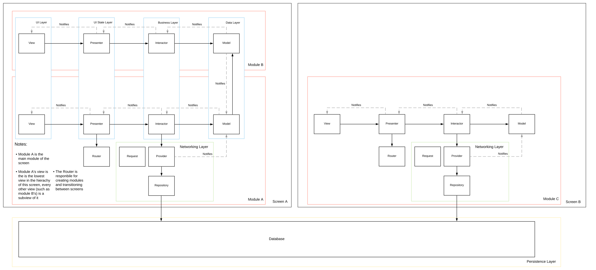

# Combine-VIPER Example

### TODO:
- Reuse cell modules and just update the model instead of recreting the module on dequeueReusableCell
- Do create a new module for cells when the model for the cell does not exist in the movies array yet
- If going to view detail before cell poster it fetched from network, then update the detail poster once the cell poster has been fetched
- Either show "select movie" screen or show first movie in list on the detail view when first opening app

An example app demonstrating VIPER architecture alongside Combine and aync/await.
The interface is UIKit although it's written in a way that allows easy upgrades to SwiftUI.

This product uses the TMDB API but is not endorsed or certified by TMDB.

## VIPER

